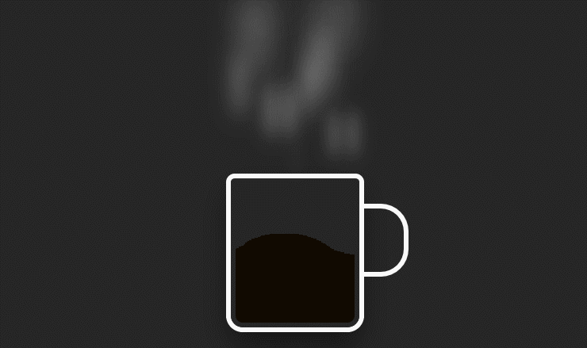

<h1 align="center">
    

        Copo de Café
    

    
</h1>

<h1 align="center">
    
</h1>

---

## Sobre

Página para aprender a utilizar alguns estilos de animacões utilizando css.
Vídeos que assisti para conseguir fazer: [vídeo1](https://youtu.be/fKdsaWrrjNM),[ vídeo2](https://youtu.be/_jOqYe0eFqY)

---

## Tecnologias utilizadas

- [x] Html
- [x] Css

---

Desenvolvido por Bruno Ferreira
